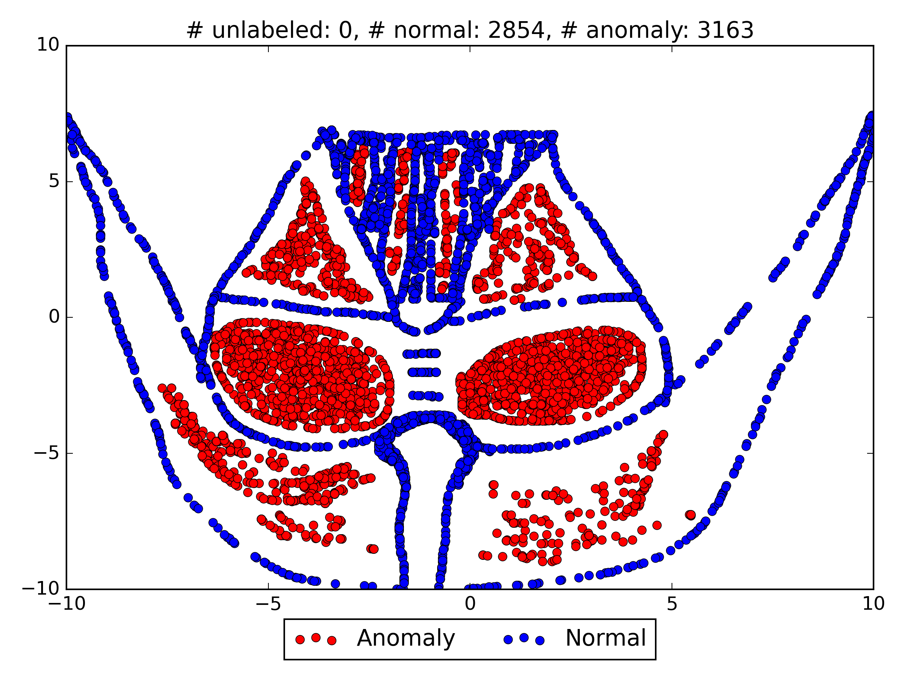
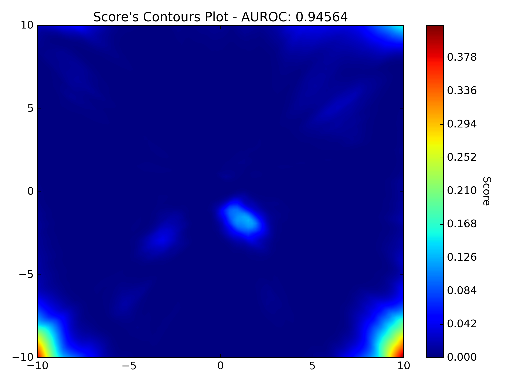
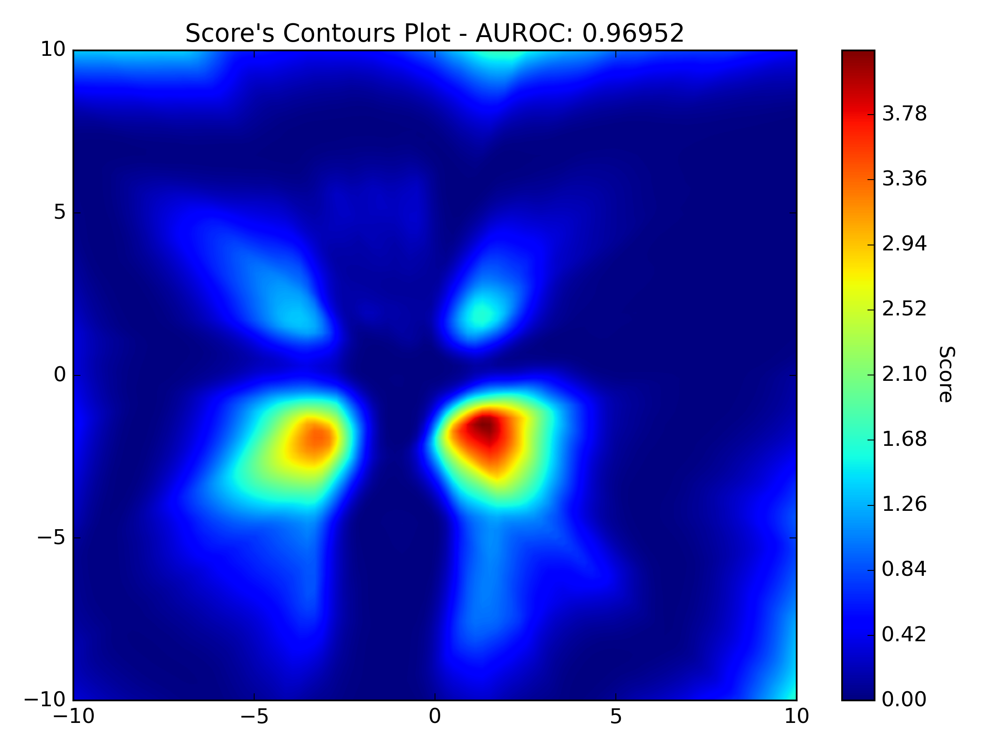
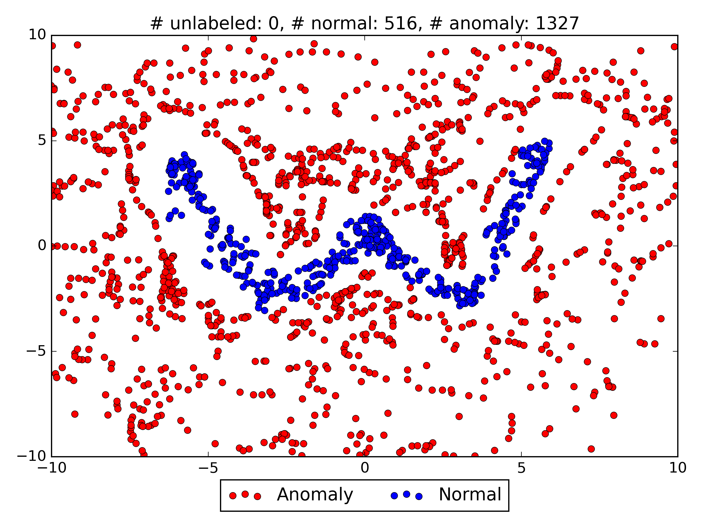
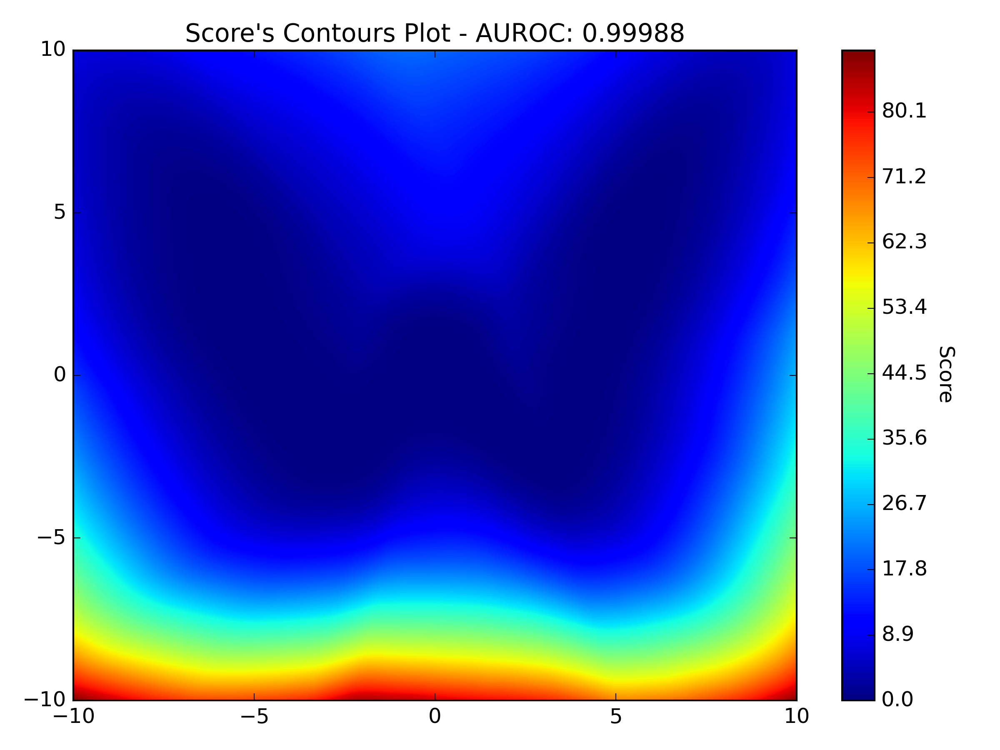
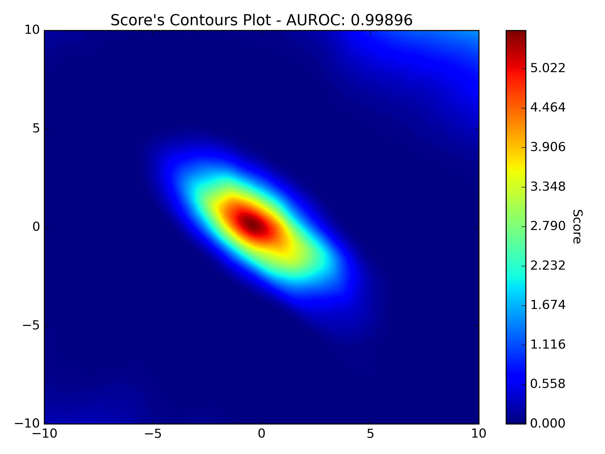
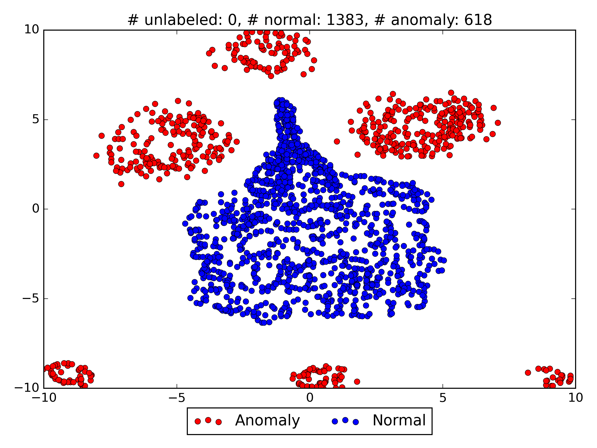
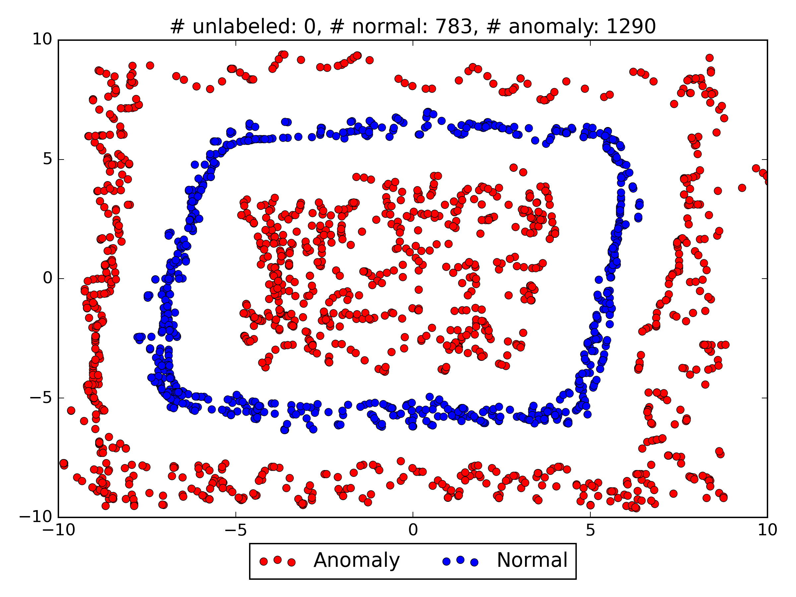
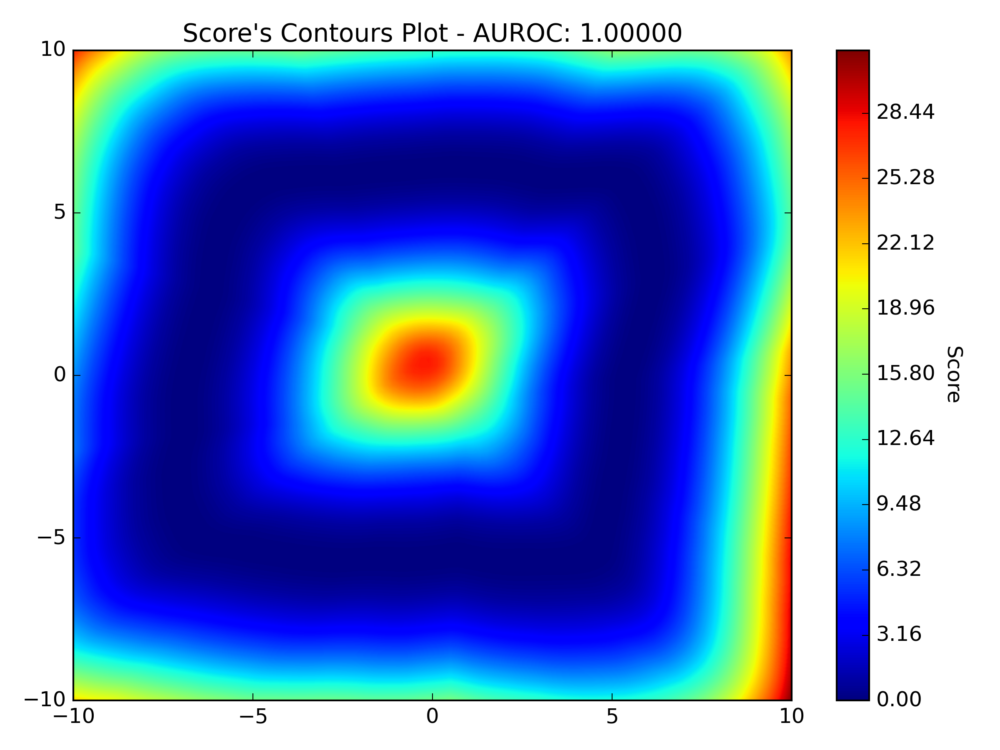
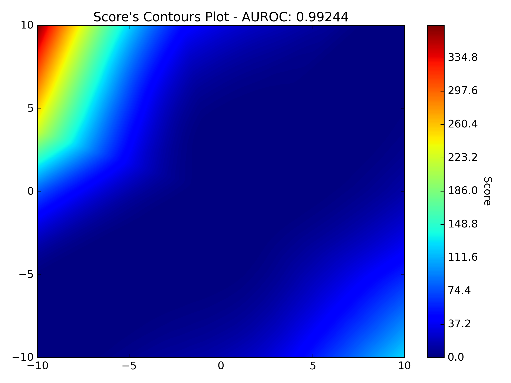

# Deep semi-supervised anomaly detection

Simple Pytorch implementation of Deep SAD with some improvements.  
  
Dataset  |                            Unsupervised                             |  Semi-Supervised (1% of labeled anomalies)                    
:----:|:-------------------------------------------------------------------:|:----:
 |  | 
  |  |         
 |  | 
 |  | 
 |  | 
 |  | 
 |  | 