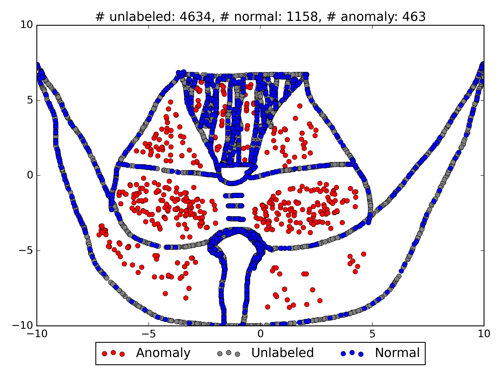
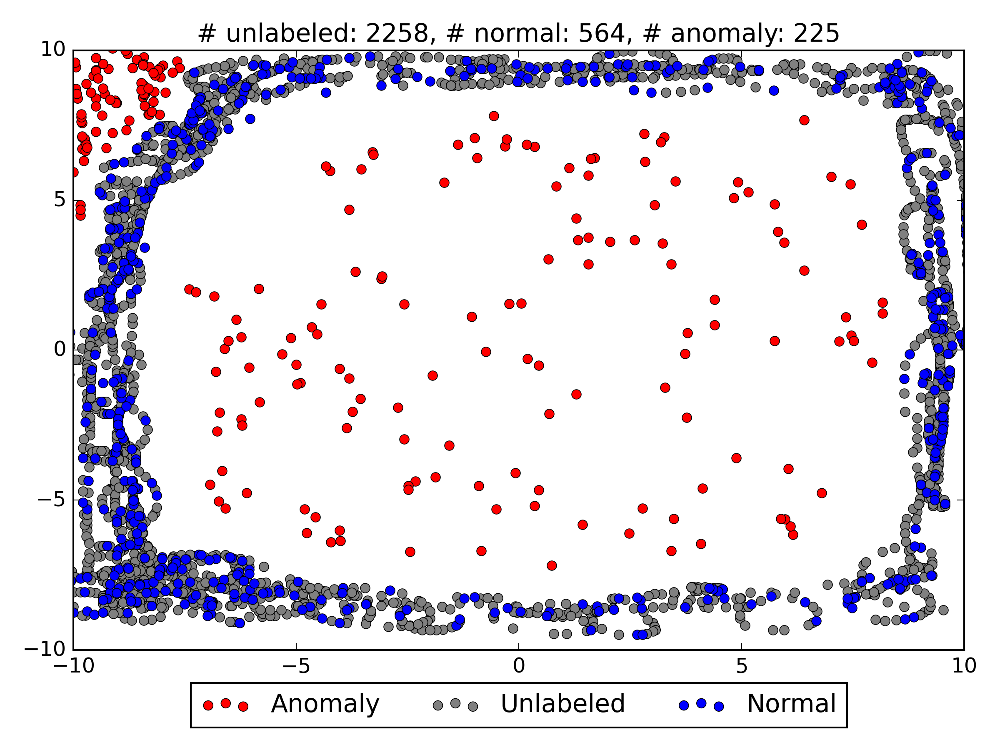
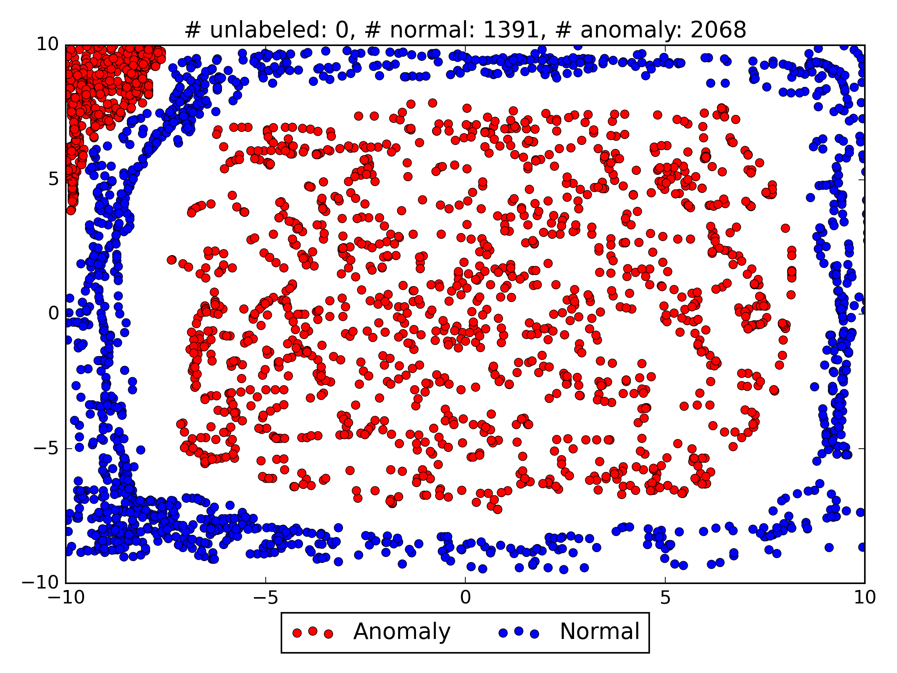
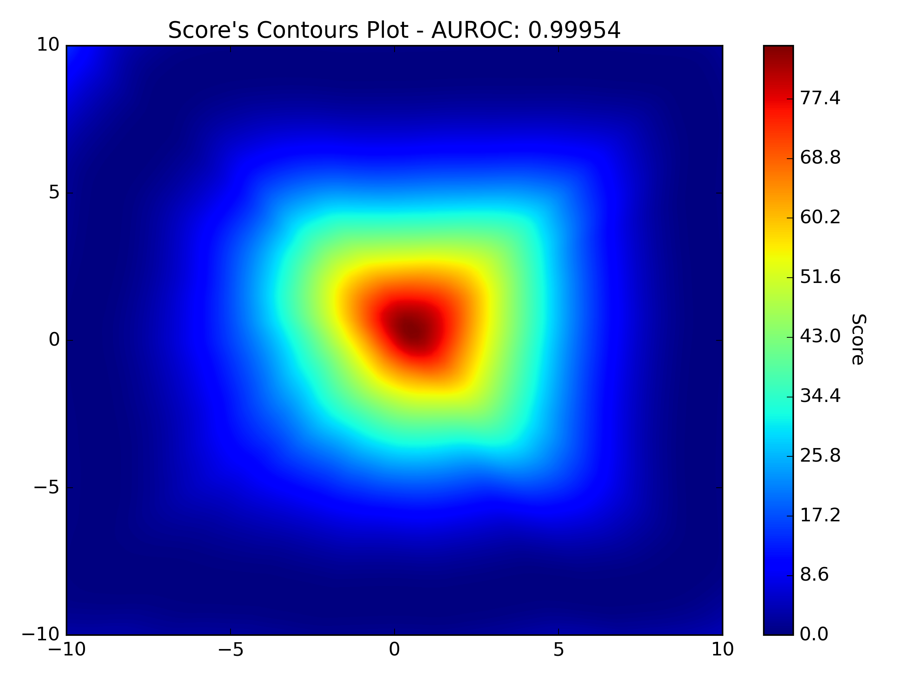
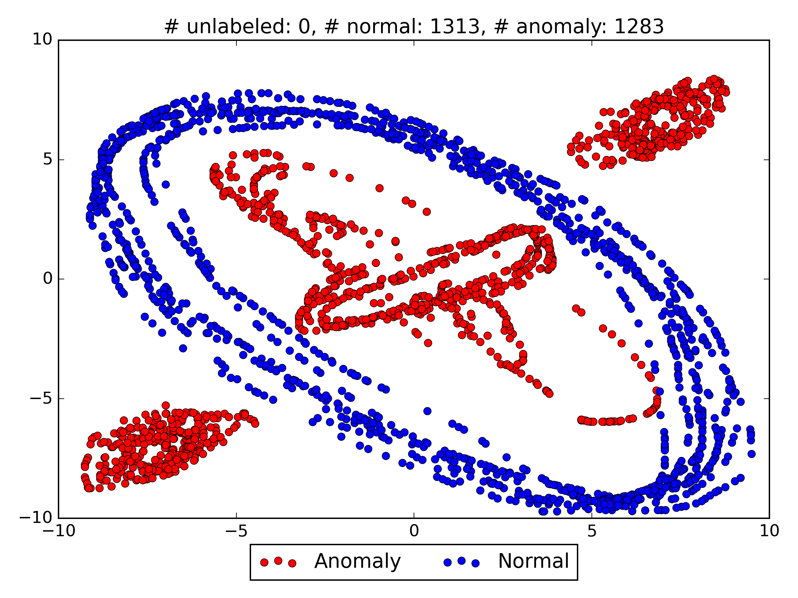
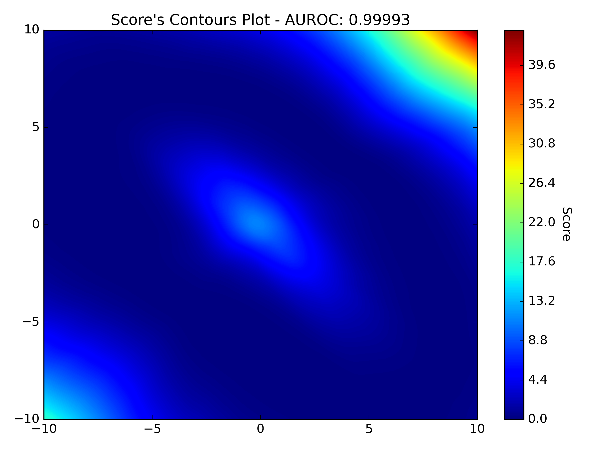
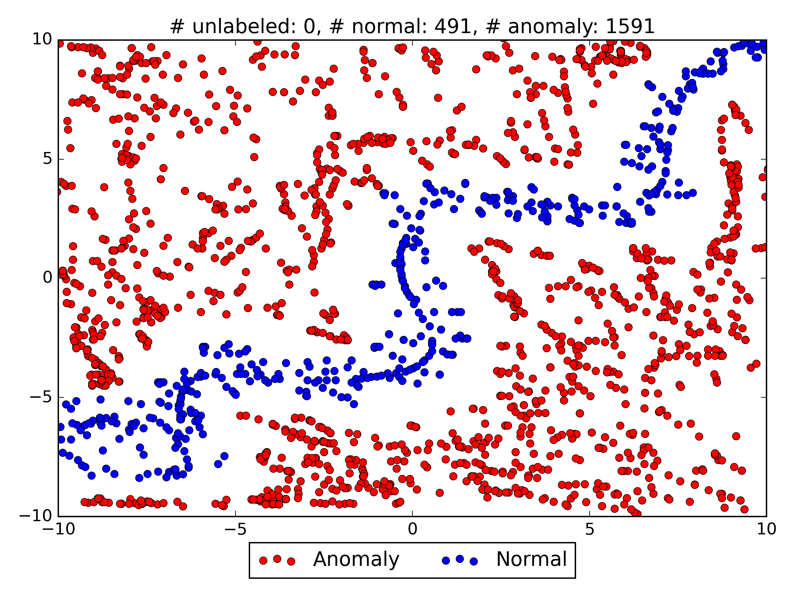

# Deep semi-supervised anomaly detection

Simple Pytorch implementation of Deep SAD.  
  
Train set (77% normal and 1% anomalies) |                                      Test set                                      | Scores contour plot
:----:|:----------------------------------------------------------------------------------:|:----:

  | 

 | 

 

  | 

 | 

  | 

 | 

  | 

 | 

  | 

 | 

  | 

 | 

  | 

 | 

